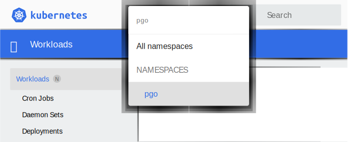
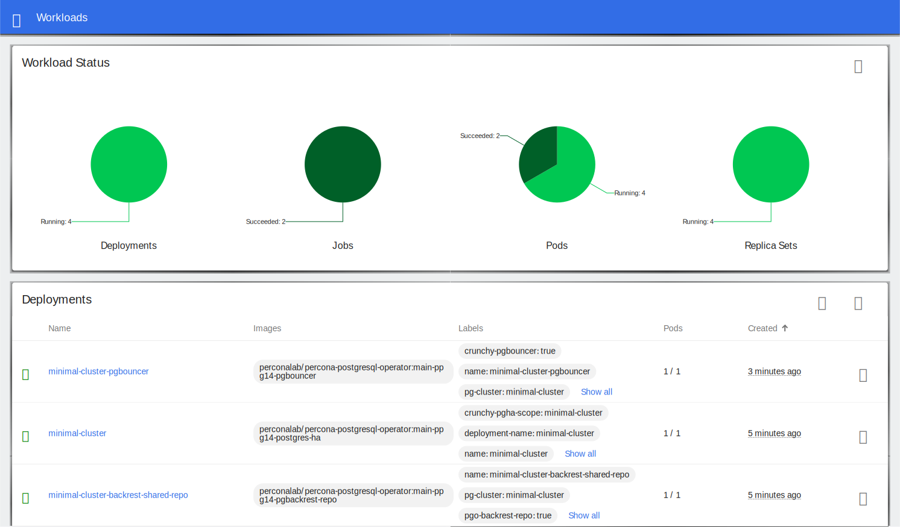

# Install Percona Distribution for PostgreSQL on Minikube

Installing the Percona Operator for PostgreSQL on [minikube](https://github.com/kubernetes/minikube)
is the easiest way to try it locally without a cloud provider. Minikube runs
Kubernetes on GNU/Linux, Windows, or macOS system using a system-wide
hypervisor, such as VirtualBox, KVM/QEMU, VMware Fusion or Hyper-V. Using it is
a popular way to test the Kubernetes application locally prior to deploying it
on a cloud.

The following steps are needed to run Percona Operator for PostgreSQL on
minikube:

1. [Install minikube](https://kubernetes.io/docs/tasks/tools/install-minikube/),
using a way recommended for your system. This includes the installation of
the following three components:

    1. kubectl tool,
    2. a hypervisor, if it is not already installed,
    3. actual minikube package

    After the installation, run `minikube start` command. Being executed,
    this command will download needed virtualized images, then initialize and run
    the cluster. After minikube is successfully started, you can optionally run
    the Kubernetes dashboard, which visually represents the state of your cluster.
    Executing `minikube dashboard` will start the dashboard and open it in your
    default web browser.

2. The first thing to do is to add the `pgo` namespace to Kubernetes,
    not forgetting to set the correspondent context for further steps:

    ```bash
    $ kubectl create namespace pgo
    $ kubectl config set-context $(kubectl config current-context) --namespace=pgo
    ```

    !!! note

        To use different namespace, you should edit *all occurrences* of
        the `namespace: pgo` line in both `deploy/cr.yaml` and
        `deploy/operator.yaml` configuration files.

    If you use Kubernetes dashboard, choose your newly created namespace to be
    shown instead of the default one:

    

3. Deploy the operator with the following command:

    ```bash
    $ kubectl apply -f https://raw.githubusercontent.com/percona/percona-postgresql-operator/v{{ release }}/deploy/operator.yaml
    ```

4. Deploy Percona Distribution for PostgreSQL:

    ```bash
    $ kubectl apply -f https://raw.githubusercontent.com/percona/percona-postgresql-operator/v{{ release }}/deploy/cr-minimal.yaml
    ```

    This deploys PostgreSQL on one node, because `deploy/cr-minimal.yaml` is
    for minimal non-production deployment. For more configuration options please
    see `deploy/cr.yaml` and [Custom Resource Options](operator.md#operator-custom-resource-options).

    Creation process will take some time. The process is over when both
    operator and replica set pod have reached their Running status:

    ```text
    $ kubectl get pods
    NAME                                                    READY   STATUS      RESTARTS   AGE
    backrest-backup-minimal-cluster-dcvkw                   0/1     Completed   0          68s
    minimal-cluster-6dfd645d94-42xsr                        1/1     Running     0          2m5s
    minimal-cluster-backrest-shared-repo-77bd498dfd-9msvp   1/1     Running     0          2m23s
    minimal-cluster-pgbouncer-594bf56d-kjwrp                1/1     Running     0          84s
    pgo-deploy-lnbv7                                        0/1     Completed   0          4m14s
    postgres-operator-6c4c558c5-dkk8v                       4/4     Running     0          3m37s
    ```

    You can also track the progress via the Kubernetes dashboard:

    

5. During previous steps, the Operator has generated several [secrets](https://kubernetes.io/docs/concepts/configuration/secret/),
    including the password for the `pguser` user, which you will need to access
    the cluster.

    Use `kubectl get secrets` command to see the list of Secrets objects(by
    default Secrets object you are interested in has `cluster1-pguser-secret`
    name). Then `kubectl get secret cluster1-pguser-secret -o yaml` will return
    the YAML file with generated secrets, including the password which should
    look as follows:

    ```yaml
    ...
    data:
      ...
      password: cGd1c2VyX3Bhc3N3b3JkCg==
    ```

    Here the actual password is base64-encoded, and
    `echo 'cGd1c2VyX3Bhc3N3b3JkCg==' | base64 --decode` will bring it back to
    a human-readable form (in this example it will be a `pguser_password`
    string).

6. Check connectivity to a newly created cluster.

    Run new Pod to use it as a client and connect its console output to your
    terminal (running it may require some time to deploy). When you see the
    command line prompt of the newly created Pod, run `psql` tool using the
    password obtained from the secret. The following command will do this,
    naming the new Pod `pg-client`:

    ```bash
    $ kubectl run -i --rm --tty pg-client --image=perconalab/percona-distribution-postgresql:{{ postgresrecommended }} --restart=Never -- bash -il
    [postgres@pg-client /]$ PGPASSWORD='pguser_password' psql -h cluster1-pgbouncer -p 5432 -U pguser pgdb
    ```

    This command will connect you to the  PostgreSQL interactive terminal.

    ```text
    psql ({{ postgresrecommended }})
    Type "help" for help.
    pgdb=>
    ```
