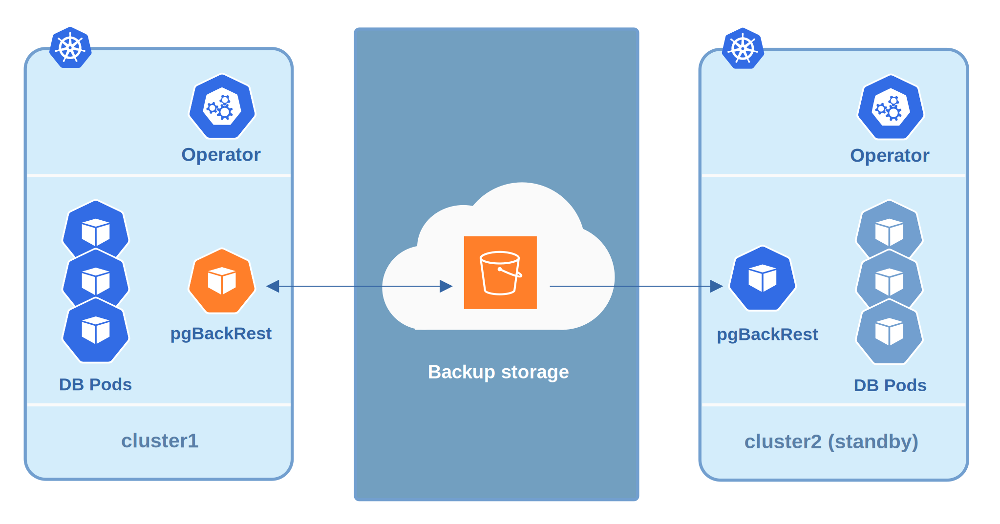
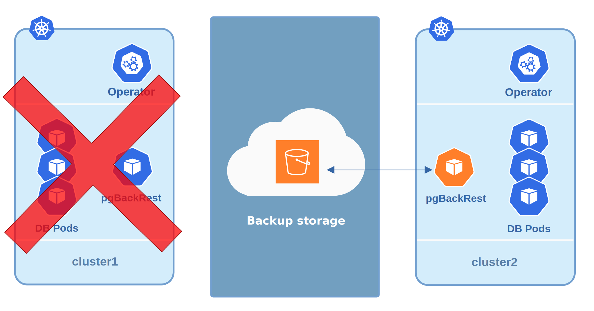

# How to deploy a standby cluster for Disaster Recovery

Deployment of a [standby PostgreSQL cluster](https://www.postgresql.org/docs/12/warm-standby.html)
is mainly targeted for Disaster Recovery (DR), though it can also be used for
migrations.

In both cases, it involves using some [object storage system for backups](backups.md#backups),
such as AWS S3 or GCP Cloud Storage, which the standby cluster can access:



* there is a *primary cluster* with configured `pgbackrest` tool, which pushes
the write-ahead log (WAL) archives [to the correct remote repository](backups.md#backups-pgbackrest-repository),
* the *standby cluster* is built from one of these backups, and it is kept in
sync with the *primary cluster* by consuming the WAL files copied from the
remote repository.

!!! note

    The primary node in the *standby cluster* is **not a streaming replica**
    from any of the nodes in the *primary cluster*. It relies only on WAL
    archives to replicate events. For this reason, this approach cannot be used
    as a High Availability solution.

Creating such a standby cluster involves the following steps:

* Copy needed passwords from the *primary cluster* Secrets and adjust them to
use the *standby cluster* name. 

    !!! note inline end

        You need the [yq tool installed](https://github.com/mikefarah/yq/#install).

    The following commands save the secrets
    files from `cluster1` under `/tmp/copied-secrets` directory and prepare
    them to be used in `cluster2`:

    ``` {.bash data-prompt="$" }
    $ mkdir -p /tmp/copied-secrets/
    $ export primary_cluster_name=cluster1
    $ export standby_cluster_name=cluster2
    $ export secrets="${primary_cluster_name}-users"
    $ kubectl get secret/$secrets -o yaml \
    yq eval 'del(.metadata.creationTimestamp)' - \
    yq eval 'del(.metadata.uid)' - \
    yq eval 'del(.metadata.selfLink)' - \
    yq eval 'del(.metadata.resourceVersion)' - \
    yq eval 'del(.metadata.namespace)' - \
    yq eval 'del(.metadata.annotations."kubectl.kubernetes.io/last-applied-configuration")' - \
    yq eval '.metadata.name = "'"${secrets/$primary_cluster_name/$standby_cluster_name}"'"' - \
    yq eval '.metadata.labels.pg-cluster = "'"${standby_cluster_name}"'"' - \
    >/tmp/copied-secrets/${secrets/$primary_cluster_name/$standby_cluster_name}
    ```

* Create the Operator in the Kubernetes environment for the *standby cluster*,
    if not done:

    ``` {.bash data-prompt="$" }
    $ kubectl apply -f deploy/operator.yaml
    ```

* Apply the Adjusted Kubernetes Secrets:

    ``` {.bash data-prompt="$" }
    $ export standby_cluster_name=cluster2
    $ kubectl create -f /tmp/copied-secrets/${standby_cluster_name}-users
    ```

* Set the `standby.repoName`, `standby.host`, and optionally `standby.port`
    Custom Resource options in the `deploy/cr.yaml` file of your
    *standby cluster* to the actual place where the *primary cluster* stores
    backups. For example, in case of `myPrimaryCluster` and `myStandbyCluster`
    clusters, it should look as follows:

    ```yaml
    ...
      name: myStandbyCluster
    ...
      standby:
        host: "myPrimaryClusterHost"
        repoName: "myPrimaryCluster-backrest-shared-repo"
    ```

* Supply your *standby cluster* with the Kubernetes Secret used by pgBackRest of
    the *primary cluster* to Access the Storage Bucket. The name of this Secret is
    `<cluster-name>-backrest-repo-config`, and its content depends on the cloud
    used for backups (refer to the Operator’s [backups documentation](backups.md#backups)
    for this step). The contents of the Secret needs to be the same for both
    *primary* and *standby* clusters except for the name: e.g.
    `cluster1-backrest-repo-config` should be recreated as
    `cluster2-backrest-repo-config`.

* Enable the standby mode in your *standby cluster’s* `deploy/cr.yaml` file:

    ```yaml
    standby
      enabled: true
    ```

When you have applied your new cluster configuration with the usual
`kubectl -f deploy/cr.yaml` command, it starts the synchronization via
pgBackRest, and your Disaster Recovery preparations are over.

When you need to actually use your new cluster, get it out from standby mode,
changing the `standby.enabled` option in your `deploy/cr.yaml` file:

```yaml
standby
  enabled: false
```

Please take into account, that your `cluster1` cluster should not exist at the
moment when you get out your `cluster2` from standby:




!!! note

    If `cluster1` still exists for some reason, **make sure it can not connect**
    to backup storage. Otherwise, both clusters sending WAL archives to it would
    cause data corruption!
